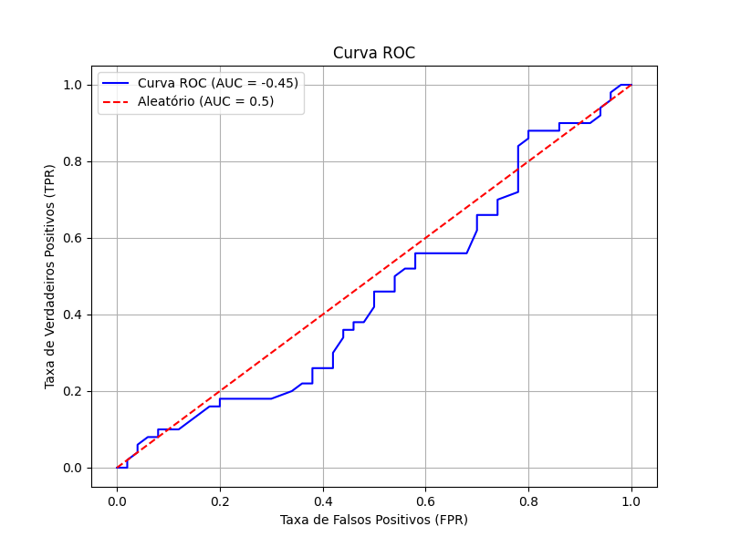

# Métricas de avaliação em machine learning

Um modelo de classificação de dados visa realizar uma previsão com base
em ocorrências passadas. Para isso, o modelo utiliza um conjunto de dados
com entradas (indivíduos) e atributos (propriedades). Além disso, é
necessário conhecer o resultado esperado para esse conjunto de dados
(rótulos). Todas essas informações serão usadas para treinar um modelo que
será utilizado para predizer resultados esperados para novos dados que
surgirem no futuro. Ao treinar esse modelo deve-se utilizar um conjunto de
dados (não usados no treinamento) para testar o quanto o modelo acerta.
Entretanto, não basta apenas contar a quantidade de acertos que seu
modelo teve para dizer se ele é bom ou não. Dependendo do problema
estudado, métricas diferentes devem ser utilizadas para essa avaliação.
Entretanto, antes de apresentarmos essas métricas, precisamos entender
alguns conceitos para classificação binárias: as classes que os dados
preditos poderão receber.

# Classes de dados preditos: VP, VN, FP e FN

Uma maneira eficaz de representar os resultados de um método de classificação é por meio da matriz de confusão. Essa ferramenta organiza os resultados em quatro categorias principais, permitindo uma análise detalhada do desempenho do modelo.

# Matriz de confusão
Muitos autores utilizam as siglas TP (true positive) e TN (true negative) como equivalentes de VP (verdadeiro positivo) e VN (verdadeiro negativo), respectivamente. A matriz fornece a quantidade de ocorrências em cada categoria, sendo adaptada de Ferrari & Silva (2017) [2].

# Exemplo prático: *predição de chuva*
Considere um programa que prevê chuva em 100 dias. Segundo o programa:

## Estrutura Geral da Matriz de Confusão

| *Matriz de confusão* | Predito: Positivo | Predito: Negativo |
|-----------------|-------------------|-------------------|
| **Real: Positivo** | VP (TP)          | FN                |
| **Real: Negativo** | FP               | VN (TN)           |

Previsão de chuva em 55 dias;
Previsão de tempo seco em 45 dias.
Após 100 dias, os dados reais foram:

Chuva em 50 dias;
Sem chuva em 50 dias.
Com base nesses resultados, a matriz de confusão do programa fica assim (Tabela 3):

## Matriz de Confusão para Predição de Chuva

|   *Matriz de confusão* | Predito: Vai Chover | Predito: Não Vai Chover |
|-----------------|---------------------|-------------------------|
| **Real: Choveu**    | VP = 40            | FN = 10                |
| **Real: Não Choveu**| FP = 15            | VN = 35                |

> _Matriz de confusão para predição de chuva (n = 100)
VP (Verdadeiros Positivos): 40 dias — O programa previu chuva, e de fato choveu.
FP (Falsos Positivos): 15 dias — O programa previu chuva, mas não choveu.
FN (Falsos Negativos): 10 dias — O programa previu tempo seco, mas choveu.
VN (Verdadeiros Negativos): 35 dias — O programa previu tempo seco, e realmente não choveu.
> A soma dos valores da matriz (VP = 40, FP = 15, FN = 10, VN = 35) é igual ao total de dias analisados (n = 100), garantindo consistência nos resultados._

Essa estrutura ajuda a interpretar o desempenho do modelo em termos de acertos (VP e VN) e erros (FP e FN), permitindo ajustes e refinamentos na classificação.

Para avaliar o desempenho de um classificador, podemos utilizar diversas métricas derivadas da matriz de confusão. Essas métricas são úteis para medir tanto a quantidade de predições realizadas corretamente quanto a capacidade do modelo em classificar dados de maneira eficaz.

# Predições e valores reais
A partir da matriz de confusão, podemos calcular o total de predições realizadas e os valores reais de cada classe:

* Predições como Positivas:

      Predito positivo = VP + FP
  
* Predições como Negativas:
                           
      Predito negativo = VN + FN
  
* Valores reais Positivos:

      Real positivo = VP + FN
                            
* Valores reais Negativos:

      Real negativo = VN + FP

# Acertos e Erros
A quantidade de acertos e erros do modelo pode ser obtida pela soma de componentes específicos da matriz:

* Acertos (previsões corretas): 
                              
      Acertos = VP + VN
    
* Erros (previsões incorretas):

      Erros = FP + FN

# Métricas para avaliação
Para avaliar a qualidade do classificador, utilizamos métricas como acurácia, sensibilidade, especificidade, precisão e F-score. Abaixo estão as definições e fórmulas para cada uma delas.

1. Acurácia (Accuracy ou ACC)
A acurácia mede o percentual de predições corretas em relação ao total de entradas. É uma métrica simples e amplamente utilizada.

### Acurácia

$$\text{Acurácia} = \frac{\text{Acertos}}{\text{Total de entradas}} = \frac{VP + VN}{VP + VN + FP + FN}$$
​
---

### 2. Sensibilidade (Recall ou Revocação)

A sensibilidade avalia a capacidade de identificar corretamente os resultados positivos: 

$$\text{Sensibilidade} = \frac{VP}{VP + FN}$$

---

### 3. Especificidade

A especificidade mede a capacidade de identificar corretamente os resultados negativos:  

$$\text{Especificidade} = \frac{VN}{VN + FP}$$

---

### 4. Precisão

A precisão verifica a proporção de verdadeiros positivos entre todas as predições positivas realizadas:  

$$\text{Precisão} = \frac{VP}{VP + FP}$$

---

### 5. F-score

O F-score, ou F1-score, é a **média harmônica** entre precisão e sensibilidade:  

$$F\text{-score} = 2 \cdot \frac{\text{Precisão} \cdot \text{Sensibilidade}}{\text{Precisão} + \text{Sensibilidade}}$$

---

### Curva ROC
A Curva ROC (Receiver Operating Characteristic Curve), ou em português, Curva Característica de Operação do Receptor, é uma ferramenta gráfica utilizada para avaliar o desempenho de classificadores binários. Esse gráfico considera dois parâmetros principais:

Taxa de Verdadeiros Positivos (TVP): também conhecida como Sensibilidade ou True Positive Rate (TPR).
Taxa de Falsos Positivos (TFP): calculada como 1−Especificidade, também chamada de False Positive Rate (FPR).

### Utilidade da Curva ROC
A curva ROC permite:

1. __Comparar diferentes classificadores__: Analisando o desempenho com base em várias configurações de limiares.
2. __Selecionar o melhor classificador__: Baseando-se em um ponto de corte que equilibre sensibilidade e especificidade conforme o problema.

  

* __Interpretação__
> * _No gráfico, o eixo Y representa a Taxa de Verdadeiros Positivos (TVP), enquanto o eixo X representa a Taxa de Falsos Positivos (TFP)._
> * _Quanto mais próximo a curva estiver do canto superior esquerdo (ou seja, maior TVP e menor TFP), melhor é o desempenho do classificador._
> * _Um classificador ideal teria uma curva que sobe imediatamente para o topo do eixo Y e depois segue ao longo do limite superior, indicando alta sensibilidade e baixa taxa de falsos positivos._

 A curva ROC é amplamente utilizada porque permite uma análise visual e comparativa dos modelos, especialmente em cenários onde diferentes métricas de desempenho podem ser conflitantes.

### Quando usar cada métrica
No desenvolvimento de modelos de _machine learning_ para problemas reais, o objetivo ideal seria criar classificadores perfeitos que sempre acertam. Contudo, na prática, isso raramente é possível. Assim, devemos buscar o melhor desempenho possível, considerando a natureza e os requisitos do problema.
A _acurácia_ é uma métrica básica e amplamente utilizada, pois fornece uma visão geral do desempenho do modelo ao medir o percentual de acertos em relação ao total de observações. No entanto, ela nem sempre é suficiente, especialmente em casos onde as classes estão desbalanceadas ou quando erros específicos têm impactos diferentes.
A escolha da métrica mais apropriada depende do objetivo do modelo e das implicações dos erros. A seguir, exploramos alguns exemplos para ilustrar a aplicação de métricas específicas em diferentes contextos.

### _Exemplo 1: Sistema de detecção de spam_

**Contexto:** Um modelo que identifica automaticamente e-mails como spam.

**Erro crítico:** Falsos positivos (mensagens importantes marcadas como spam).
      *Esse tipo de erro pode causar prejuízo ou frustração ao usuário.*
**Métrica ideal:** _Precisão_, pois ela mede a proporção de verdadeiros positivos (e-mails corretamente classificados como spam) em relação a todos os e-mails classificados como spam.
      *Um alto valor de precisão minimiza os falsos positivos, garantindo que a maioria das mensagens classificadas como spam realmente o sejam.*

### _Exemplo 2: Sistema de detecção de falhas em aviões_

**Contexto:** Um modelo que identifica problemas em peças de um avião.

**Erro crítico:** Falsos negativos (falhas não detectadas).   
      *Esse tipo de erro pode colocar vidas em risco.*
Métrica ideal: *Sensibilidade (ou Recall)*, pois ela mede a proporção de verdadeiros positivos em relação ao total de casos realmente positivos (incluindo os falsos negativos).
      *Um alto valor de sensibilidade garante que a maioria das falhas sejam detectadas, mesmo que isso resulte em um pequeno aumento de falsos positivos, o que é menos crítico nesse cenário.*

### Conclusão
A escolha da métrica deve sempre ser guiada pelo impacto dos erros no contexto do problema.

* **Acurácia:** Boa para cenários balanceados, onde os erros têm impactos semelhantes.
* **Precisão:** Essencial quando falsos positivos são mais prejudiciais.
* **Sensibilidade:** Ideal quando falsos negativos têm consequências graves.

Modelar problemas reais exige compreender não apenas os dados, mas também o contexto em que o modelo será aplicado e as implicações dos diferentes tipos de erros.

